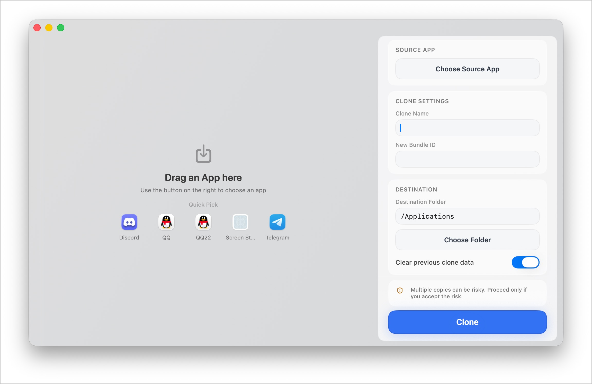

# Dual

[English](./README.md) | [简体中文](./README.zh-CN.md)

Dual is a macOS app for cloning application bundles into a separate copy with a new name, bundle identifier, and app identity. It is designed for users who need a second copy of an app for testing, isolated sessions, or multi-account workflows.



| App             | Logo                                                                        | Work |
| --------------- | --------------------------------------------------------------------------- | ---- |
| Wechat          |                    | ✅   |
| QQ              |                            | ✅   |
| WechatBussiness |  | ✅   |
| Ghostty         |                  | ✅   |
| Kaku            |                        | ✅   |
| IINA            |                        | ✅   |
| Telegram        |                | ✅   |
| Discord         |                  | ✅   |


## What It Does

- Clones a selected `.app` bundle into a new destination.
- Rewrites the cloned app’s `Info.plist` with a new display name and bundle identifier.
- Renames helper apps when the source app uses helper bundles, so the copied bundle stays launchable.
- Removes stale quarantine data and re-signs the result.
- Optionally clears previous clone data before creating a new copy.
- Supports administrator privileges when the target location requires elevated access.
- Shows a live log panel and final status, including a Finder reveal action after success.

## Key Features

- Drag and drop any `.app` bundle into the window.
- Quick-pick common apps from `/Applications` and `~/Applications`.
- Custom clone name and bundle identifier fields.
- Destination folder selection with writable-path handling.
- Localized UI strings in English and Simplified Chinese.
- Polished macOS-style UI with live progress and success states.

## How It Works

The app uses SwiftUI for the interface and an `AppCloner` pipeline behind the scenes. That pipeline copies the source app, updates identity metadata, applies app-specific compatibility fixes when needed, and re-signs the bundle so the clone can launch normally.

## Build and Release

The repository includes a GitHub Actions workflow that builds macOS `zip` and `dmg` artifacts for Intel and Apple Silicon, and can publish them to GitHub Releases on tagged or manually triggered runs.

## Installing Test Releases

Current GitHub Releases are unsigned and not notarized. That means macOS Gatekeeper may show messages such as `"Dual" is damaged and can’t be opened` or block the app on first launch. This is expected for the current test distribution flow.

Recommended install flow for testers:

1. Move `Dual.app` into `/Applications`.
2. Remove the quarantine attribute:

```bash
./scripts/remove-quarantine.sh /Applications/Dual.app
```

3. If macOS still blocks launch, apply a local ad-hoc signature:

```bash
./scripts/re-sign-local.sh /Applications/Dual.app
```

4. Launch the app with Finder -> right click -> `Open` on the first run if needed.

Important constraints:

- This is a temporary workaround for test builds only.
- Public distribution without Apple Developer signing and notarization will remain unreliable across macOS versions.
- The helper scripts accept a custom app path if the app is not installed in `/Applications`.

## Project Structure

- `Dual/` - the macOS app source
- `scripts/` - build and local maintenance scripts
- `.github/workflows/` - GitHub Actions packaging workflow
