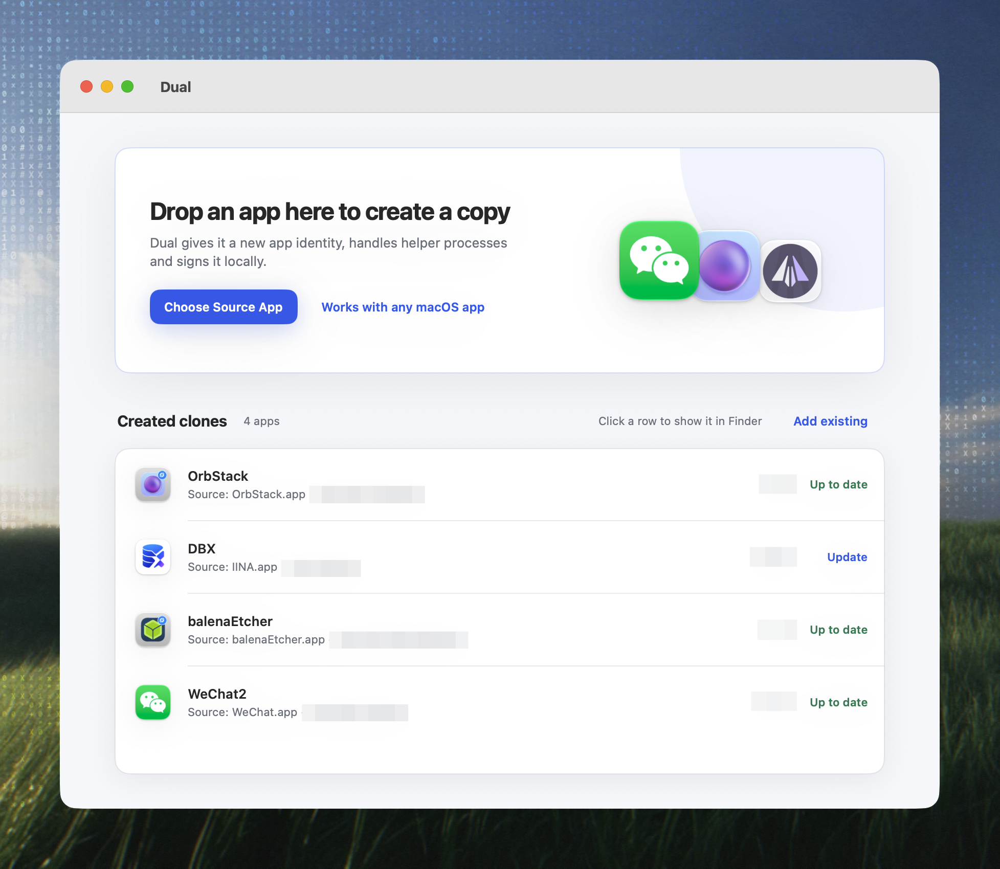
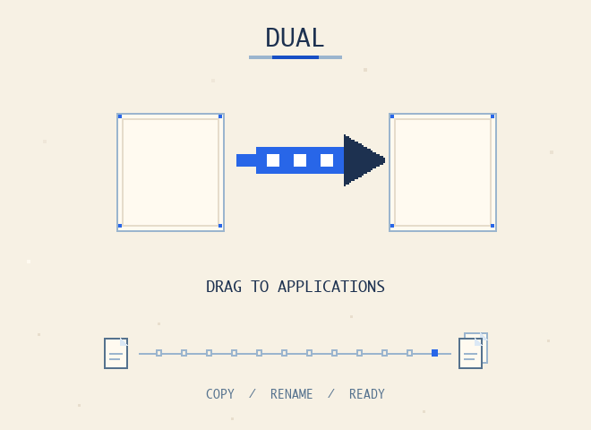

# Dual

[English](./README.md) | [简体中文](./README.zh-CN.md)

Clone any macOS app into an independent copy with its own name, bundle identifier, and identity.

[](./LICENSE)
[](https://github.com/helson-lin/Dual/releases/latest)
[](https://github.com/helson-lin/Dual/releases)
[](https://github.com/helson-lin/Dual)

Dual copies a selected `.app` bundle to a new destination, rewrites its display name and bundle identifier, and re-signs it so the clone launches and runs independently of the original — useful for testing, isolated sessions, or running multiple accounts of the same app side by side.



## Features

- Clone a selected `.app` bundle into a new destination with its own display name and bundle identifier.
- Drag and drop any `.app`, or quick-pick common apps found in `/Applications` and `~/Applications`.
- Rename helper apps for apps that ship helper bundles, so the clone stays launchable.
- Apply app-specific compatibility fixes and give Electron clones a separate user-data directory on every launch, including launches from Finder.
- Optionally add a badge icon to the clone so it's visually distinguishable from the original.
- Clear previous clone data before creating a new copy, with optional deeper isolation cleanup.
- Remove stale quarantine attributes and re-sign the cloned bundle.
- Request administrator privileges when the destination requires elevated access.
- Track existing clones and show their source/up-to-date status, with a live log panel and a Finder reveal action after success.
- Localized UI in English and Simplified Chinese.

## Requirements

- macOS 12.0 (Monterey) or later.
- Apple Silicon and Intel Macs are both supported.

## Installation

### Homebrew

Install Dual from the `helson-lin/tap` Homebrew tap:

```bash
brew tap helson-lin/tap
brew install --cask helson-lin/tap/dual
```

### Download

Download the latest `.dmg` for your Mac from [GitHub Releases](https://github.com/helson-lin/Dual/releases/latest), open it, then drag Dual into Applications.



## Usage

1. Drag an `.app` bundle onto the drop zone, or quick-pick one of the suggested apps from `/Applications` or `~/Applications`.
2. In the clone panel, set the clone's display name and bundle identifier (Dual suggests defaults based on the source app).
3. Choose a destination directory, or keep the default `/Applications/Cloned`.
4. Optionally enable the clone badge icon and clearing prior clone data, then start the clone.
5. When cloning finishes, use the reveal action to open the new copy in Finder.

## Compatibility

Compatibility fixes have been verified for the apps below. Other apps may clone successfully too — please open an issue or PR with your results to help grow this table.

| App             | Logo                                                                        | Work |
| --------------- | --------------------------------------------------------------------------- | ---- |
| WeChat          |                    | ✅    |
| QQ              |                            | ✅    |
| WeChat Business |  | ✅    |
| Ghostty         |                  | ✅    |
| Kaku            |                        | ✅    |
| IINA            |                        | ✅    |
| Telegram        |                | ✅    |
| Discord         |                  | ✅    |

## How It Works

The UI is SwiftUI; the actual cloning runs through an `AppCloner` pipeline:

1. Read the source app's bundle identifier and detect an app-specific compatibility profile (for example Telegram or Discord).
2. Reject the request if the new bundle identifier matches the source's.
3. Generate a badge icon for the clone, if enabled.
4. Clear previous clone data (and deeper per-app isolation data, if needed) before copying.
5. Copy the app bundle with `ditto`, replacing any existing destination.
6. Rewrite `Info.plist` with the new display name and bundle identifier, and install the badge icon.
7. Apply app-specific patches (Telegram identity label, Discord user-data path) when needed.
8. Rename Electron helpers and the main executable; for Electron clones, install a launcher that passes a per-bundle-ID `--user-data-dir` before re-signing.
9. Clear extended attributes and re-sign the cloned bundle with `codesign`.

## Development

Building locally requires Xcode with the macOS 12.0 SDK or later.

```bash
open Dual.xcodeproj
```

To produce a signed, notarized, packaged build the same way CI does, use `scripts/build-release.sh` (set `ARCH` to `arm64` or `x86_64`):

```bash
ARCH=arm64 scripts/build-release.sh
```

Other scripts in `scripts/`:

| Script                         | Purpose                                                              |
| ------------------------------ | -------------------------------------------------------------------- |
| `build-release.sh`             | Builds, signs, notarizes, and packages a release `zip`/`dmg`.        |
| `configure-signing-secrets.sh` | Interactively uploads Apple signing/notarization secrets to GitHub.  |
| `configure-update-secrets.sh`  | Interactively generates and uploads Sparkle EdDSA update keys.       |
| `re-sign-local.sh`             | Ad-hoc re-signs a local `.app` copy for development testing.         |
| `remove-quarantine.sh`         | Strips the `com.apple.quarantine` extended attribute from an `.app`. |
| `sync-homebrew-tap.sh`         | Publishes an updated cask to the `helson-lin/homebrew-tap` repo.     |

## Release & Distribution

The `Build macOS` GitHub Actions workflow (`.github/workflows/build-macos.yml`) builds Intel and Apple Silicon variants, signs them with a Developer ID certificate, and notarizes them with `notarytool` via `scripts/build-release.sh`. On a tagged push (or a manual dispatch with a release tag) it also:

- Generates a Sparkle EdDSA-signed appcast for each architecture, so the app can check for and install updates in place.
- Publishes the signed `zip`/`dmg` artifacts and appcasts to a GitHub Release.
- Syncs the `helson-lin/homebrew-tap` cask (`scripts/sync-homebrew-tap.sh`) with the new version, build number, and checksums.

Run `scripts/configure-signing-secrets.sh` to set up the Apple signing/notarization secrets, and `scripts/configure-update-secrets.sh` to set up the Sparkle update keys, before the workflow can produce a signed release.

## Project Structure

```text
Dual/
├── Dual/                      # SwiftUI app source (views, AppCloner pipeline, localization)
├── Dual.xcodeproj/            # Xcode project configuration
├── scripts/                   # Build, signing, and maintenance scripts
├── .github/workflows/         # GitHub Actions build & release workflow
├── assets/                    # README screenshot(s)
├── background.png             # DMG installer background art
└── LICENSE                    # GPLv3 + Commons Clause license text
```

## Troubleshooting

**Broken or stale Homebrew cask.** If a previous install was removed manually, or the cask record no longer matches the installed app, force-remove it before reinstalling:

```bash
brew uninstall --cask --force helson-lin/tap/dual
brew install --cask helson-lin/tap/dual
```

**Gatekeeper blocks the app on first launch.** Releases are signed and notarized, so this is usually a leftover quarantine flag from how the app was copied. Clear it with `scripts/remove-quarantine.sh` (defaults to `/Applications/Dual.app`), which strips the `com.apple.quarantine` attribute only — it does not replace signing or notarization:

```bash
scripts/remove-quarantine.sh /Applications/Dual.app
```

If it's still blocked, right-click the app in Finder and choose Open, or allow it in System Settings → Privacy & Security.

## Contributing

Issues and pull requests are welcome. The [Compatibility](#compatibility) table is community-driven — if you've cloned an app not listed there, please share your results.

## License

Dual is licensed under GNU GPLv3 with additional Commons Clause terms. Personal, non-commercial use only unless the copyright holder grants explicit written permission. Derivative works must retain the same license terms. See [LICENSE](./LICENSE) for the complete terms.
