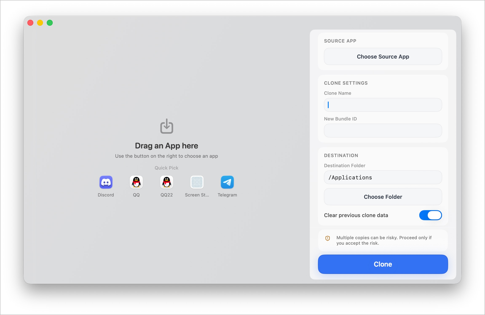

# Dual

[English](./README.md) | [简体中文](./README.zh-CN.md)

Dual 是一款 macOS 多开应用，用于将应用 bundle 克隆成一个新的独立副本，并赋予新的名称、Bundle ID 和应用身份。它适合需要创建第二个应用实例的人，例如测试、隔离账号或多开场景。

| 应用            | 图标                                                                        | 结果 |
| --------------- | --------------------------------------------------------------------------- | ---- |
| Wechat          |                    | ✅   |
| QQ              |                            | ✅   |
| WechatBussiness |  | ✅   |
| Ghostty         |                  | ✅   |
| Kaku            |                        | ✅   |
| IINA            |                        | ✅   |

## 项目做什么

- 将选中的 `.app` bundle 克隆到新的目标位置。
- 重写克隆应用的 `Info.plist`，设置新的显示名和 Bundle ID。
- 在源应用使用 helper bundle 时，对相关 helper 进行重命名，保证副本仍然可以正常启动。
- 清理旧的 quarantine 数据，并对结果重新签名。
- 可选地在创建副本前清理旧的克隆数据。
- 在目标目录需要权限时，可通过管理员权限完成复制。
- 提供实时日志面板、执行状态和完成后的 Finder 定位按钮。

## 核心功能

- 支持将任意 `.app` 直接拖拽到窗口中。
- 会从 `/Applications` 和 `~/Applications` 中快速推荐常见应用。
- 可自定义副本名称和 Bundle ID。
- 支持选择目标目录，并处理目录可写性。
- UI 同时提供英文和简体中文。
- 具有 macOS 风格的界面、实时进度和成功状态展示。

## 工作方式

应用界面使用 SwiftUI 实现，底层由 `AppCloner` 流程负责实际克隆。该流程会复制源应用、更新身份元数据、在必要时应用具体应用所需的兼容性修复，并重新签名，从而让副本可以正常启动。

## 构建与发布

仓库包含 GitHub Actions 工作流，会为 Intel 和 Apple Silicon 构建 macOS 的 `zip` 和 `dmg` 产物，并在打 tag 或手动触发时发布到 GitHub Releases。

## 项目结构

- `Dual/` - macOS 应用源代码
- `scripts/` - 构建和本地维护脚本
- `.github/workflows/` - GitHub Actions 打包工作流
